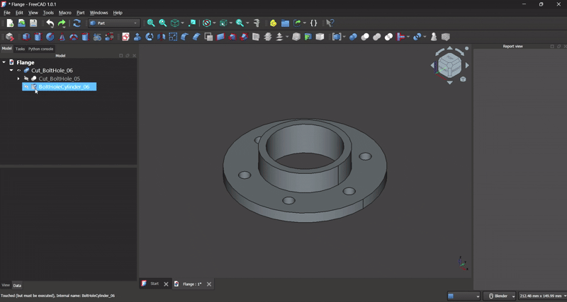

# CADomatic 🛠️  
**From prompt to CAD**

[**Preview CADomatic on Hugging face**](https://huggingface.co/spaces/Yas1n/CADomatic)

CADomatic is a Python-based tool that generates editable parametric CAD scripts for FreeCAD. Instead of creating static 3D models, CADomatic produces **fully customizable CAD models with Python scripts** that build CAD geometry — allowing engineers to programmatically define parts, reuse templates, and iterate fast.

---

## 🔍 What It Does

  
*CADomatic Demo*

  
*Fully editable parametric designs*

- ✅ **Generates editable FreeCAD Python scripts** for parts like screws, nuts, fasteners, and more
- ✅ Each script can be modified for custom parameters (length, diameter, features, etc.)
- ✅ Outputs native `.py` scripts which use FreeCAD’s API to build geometry
- ✅ Enables **version-controlled**, reusable, parametric CAD pipelines
- ✅ Eliminates the need for manual modeling in the FreeCAD GUI

---
## 💡 Why Use CADomatic?

- 🔁 Automate repetitive CAD tasks
- 🧱 Build part libraries as **code**
- 🧪 Integrate CAD into testing or CI workflows
- 🔧 Customize geometry by changing script parameters
- 📐 Keep models lightweight and editable at the code level

---
## 💬 Example Prompts

Here are some example natural language prompts you can use to generate CAD scripts with CADomatic:

- "Build a flange with a 100mm outer diameter, 10mm thickness, and 6 bolt holes evenly spaced."
- "Make a cylindrical spacer, 20mm diameter and 30mm height, with a 5mm through hole."
- "Produce a washer with an outer diameter of 25mm and an inner diameter of 10mm."
- "Design a toy car with a rectangular box as the body and 4 circular wheels attached to the sides of the box."

These prompts will be converted into editable Python scripts that you can modify and reuse.


---
⚠️ **This is the first version** of CADomatic — a flash of what's possible.  
Future versions under development will include:
- Improved **LLM-driven script generation**
- A **dedicated user interface** for part selection and parameter tuning
- More robust **template and geometry libraries**
---
## 🚀 How to Use CADomatic

### ✅ Prerequisites
- Python 3.11+
- [FreeCAD](https://www.freecad.org/downloads.php) (must be installed and added to PATH)
- [uv](https://github.com/astral-sh/uv) (install via `pip install uv`)

### ⚙️ Setup
```bash
git clone https://github.com/yas1nsyed/CADomatic.git
cd CADomatic

# Create and activate virtual environment
python -m venv .venv
.venv\Scripts\activate  

# Install dependencies
uv pip install -r requirements.txt
```

- 🔐 [Set Up Gemini API Key](https://aistudio.google.com/app/apikey)
- Create a .env file in the project root:

- ▶️ Run CADomatic
```bash
# Run the program
uv run main.py
```
- Enter your prompt (e.g., "Create a 10mm cube with 2mm hole").
- FreeCAD will auto-launch with your generated model.

---
